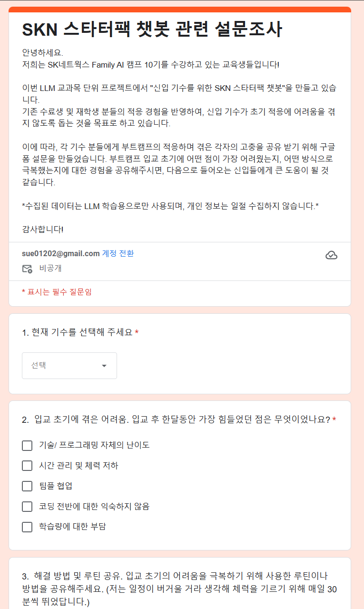
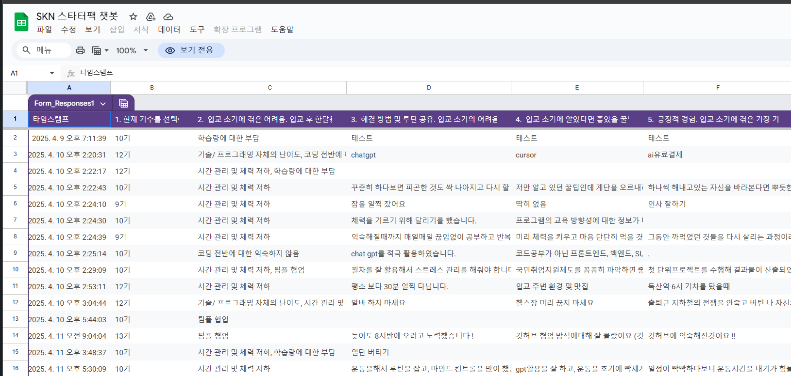
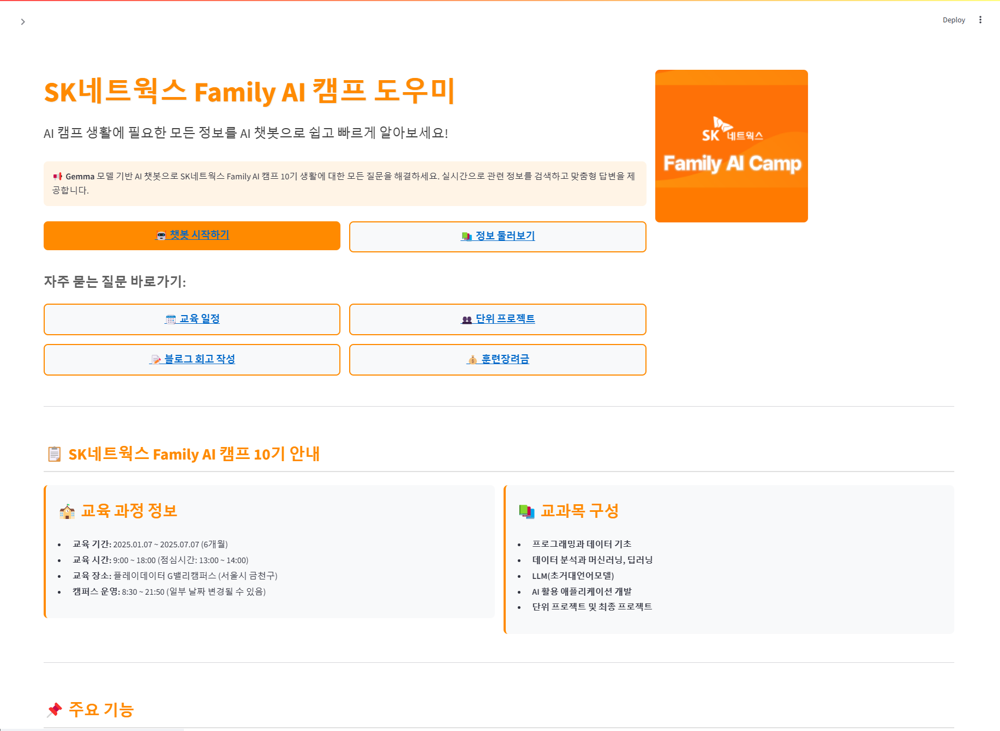
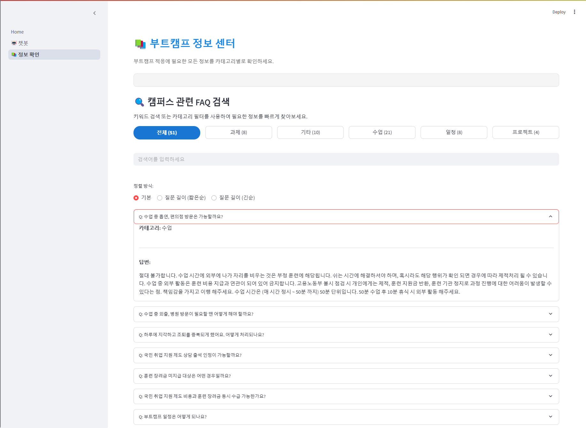
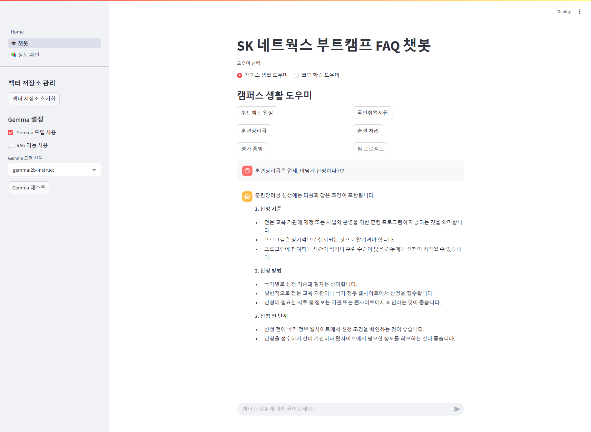
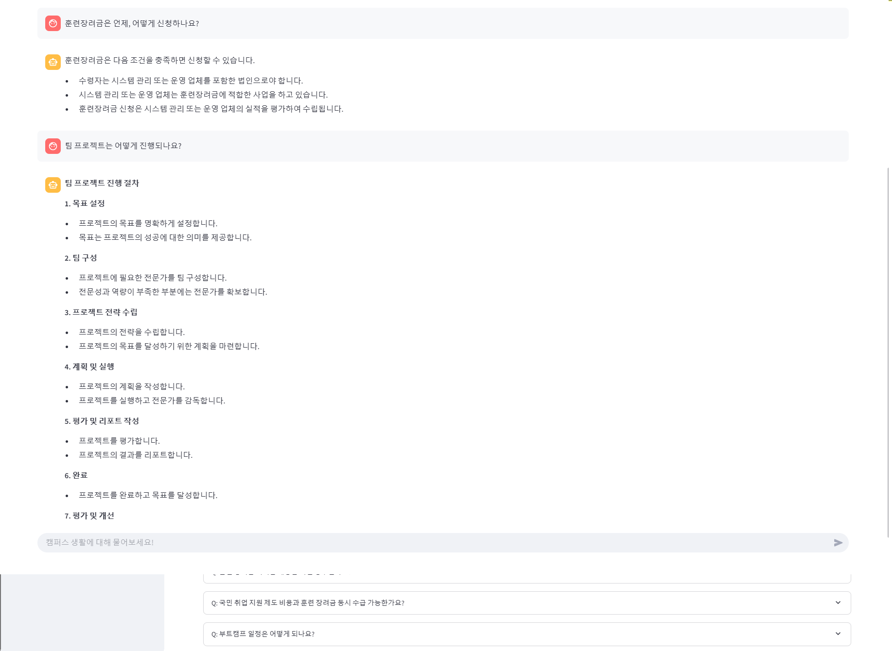

# SKN10-3rd-2Team

# 0. 팀 소개
  ### 팀명: SK네트웍스 Family AI 캠프 도우미
 

### 팀원 소개

<table align="center" width="100%">
  <tr>
    <td align="center">
      <a href="https://github.com/PyeonMin"><b>@편성민</b></a>
       
      
    </td>
    <td align="center">
      <a href="https://github.com/Leegwangwoon"><b>@이태수</b></a>
       
      
    </td>
    <td align="center">
      <a href="https://github.com/daainn"><b>@권석현</b></a>
       
      
    </td>
    <td align="center">
      <a href="https://github.com/ohback"><b>@배민경</b></a>
       
      
    </td>
    <td align="center">
      <a href="https://github.com/SIQRIT"><b>@정소열</b></a>
       
      
    </td>
  </tr>
</table>

 

# 1. 프로젝트 개요

### 프로젝트 명
- BootCampGPT : LLM 기반 부트캠프 학습 Q&A 시스템

### 프로젝트 목표 및 주요 역할
- **목표**: 부트캠프 수강생들이 학습 중 겪는 고충과 질문을 해결하고, 수료생의 회고 데이터를 기반으로 실전적인 인사이트를 제공하는 LLM 기반 Q&A 시스템을 구축하는 것
- **주요 역할**: 학습 중 막힘에 대한 실시간 해결, 실전 기반 피드백 제공, 반복 질문 자동화 대응, 학습 단계별 방향 제시

### 대상
- AI/프로그래밍 부트캠프 수강생, 비전공자, 초심자

### 프로젝트 배경

  
  

- 최근 개발자에 대한 수요가 증가하면서 비전공자들의 개발 학습 참여가 활발해지고 있으나, 여전히 진입 장벽은 높은 상황

- 낯선 용어와 개념, 반복되는 오류와 시행착오 속에서 비전공자들이 학습 과정에서 좌절을 겪는 경우가 많고, 실제로 30명 중 29명이 중도 포기할 만큼 이탈률이 높은 것으로 나타남

- 독학 환경의 한계, 실시간 피드백 부재, 학습 방향에 대한 혼란 등이 주요 원인으로 지적됨

- 이에 따라 학습자가 보다 쉽게 진입하고, 완주할 수 있도록 돕는 지원 환경 조성과 정보 제공의 필요성이 커지고 있음

🔗 **출처**
- https://www.bizhankook.com/bk/article/22027
- https://h21.hani.co.kr/arti/society/society_general/53606.html
  

### 기대효과
- **부트캠프 학습자의 이탈률 감소**: 유사한 상황에서의 실제 경험을 신속하게 참고할 수 있는 구조를 제공함으로써, 비전공자들이 겪는 초기 좌절과 혼란을 줄이고 학습 지속률을 높일 수 있음

- **실전 중심의 피드백 확보**: 단순한 교과서적 설명이 아닌 실제 수강생의 시행착오와 선택 경험이 담긴 응답을 통해, 보다 현실적이고 실행 가능한 도움을 제공

- **부트캠프 운영 측면에서의 교육 질 향상**: 수강생들이 자주 겪는 문제나 질문 유형을 분석해 커리큘럼을 보완하거나 강의 포인트를 조정하는 데 활용 가능

# 2. 기술 스택

| 구분 | 기술 | 설명 |
|------|------|------|
| **언어/환경** |  Python, `.env` | 전체 백엔드 로직 구현, 환경 설정 |
| **웹 프레임워크** |  Streamlit | 사용자 인터페이스 구성 |
| **데이터 수집** |  requests, BeautifulSoup, fake-useragent | 블로그 및 문서 크롤링 |
| **데이터 처리** |  pandas, re, tqdm | 텍스트 전처리 및 필터링 |
| **문서 처리** | RecursiveCharacterTextSplitter, Document, DataLoader | Q&A 문서 생성 및 청크 분할 |
| **벡터 저장소** | FAISS (via LangChain) | 문서 임베딩 및 유사 문서 검색 |
| **임베딩 모델** |  OllamaEmbeddings, nomic-embed-text | 사용자 쿼리 및 문서 임베딩 처리 |
| **LLM** |  gemma:2b (Ollama), OpenAI GPT,  llama-cpp | 문맥 기반 응답 생성 |
| **RAG 엔진** | VectorStore + similarity_search | RAG 기반 질의응답 구현 |
| **다중 질의 / 재순위화** | MultiQueryRetriever, CrossEncoderReranker | 질의 다양화 및 문서 정렬 향상 |
| **문서 압축 검색** | ContextualCompressionRetriever | 불필요한 정보 제거한 요약 검색 |
| **통합 프레임워크** | LangChain | 벡터 검색, 문서 처리, Retriever 구성 등 전체 파이프라인 기반 |

# 3. 시스템 아키텍처

## 시스템 구조

### 주요 컴포넌트 설명

| 파일명 | 설명 |
|--------|------|
| `chatbot.py`, `1_🤖_챗봇.py` | Streamlit UI에서 질문 받고 응답 생성 |
| `vector_store.py` | 벡터 저장소 구축 및 유사 문서 검색 핵심 모듈 |
| `embedding_model.py` | nomic-embed-text 기반 임베딩 처리 |
| `llm_model.py` | llama-cpp 로드 및 프롬프트 기반 텍스트 생성 |
| `retriever.py` | 다중 쿼리 및 압축 검색 리트리버 생성기 |
| `reranker.py` | CrossEncoder 기반 재순위화기 적용 |
| `data_loader.py` | CSV를 LangChain Document로 로딩 |
| `document_processor.py` | 문서 청크 분할 처리 |

## 작동 흐름 요약 (RAG Pipeline)

1. 사용자가 질문을 입력하면 `chatbot.py`가 처리
2. `VectorStore`를 통해 관련 문서 검색
3. 필요 시 다중 쿼리/재순위화 적용 (retriever, reranker)
4. 최종 context를 기반으로 LLM이 응답 생성
5. Streamlit UI로 결과 출력

# 4. 데이터 수집 및 전처리 안내

1). 데이터 출처

- 본 데이터는 주로 네이버 및 유튜브 플랫폼에서 수집

- 네이버 블로그: 네이버 검색 API 및 웹 크롤링

- 유튜브 영상: 유튜브 자막을 API를 통해 직접 수집

- 회고록 블로그: 7~12기의 블로그 회고록에서 부트캠프 입소자가 겪는 다양한 문제를 정형화 시켜 추출

- 구글 설문: 구글 설문 폼을 사용해 각자가 겪은 생생한 고충 공유

### 설문 조사 양식

  

### 설문 조사 결과

  

2). 데이터 수집 방법

- 네이버 블로그, tistory, google 등

- 네이버 개발자센터에서 발급받은 비로그인 오픈 API 키 (Client ID, Client Secret) 사용

- 크롤링 시 브라우저 환경을 모방하기 위해 다음과 같은 헤더 사용:

headers = {
    "User-Agent": "Mozilla/5.0 (Windows NT 10.0; Win64; x64) AppleWebKit/537.36 (KHTML, like Gecko) Chrome/134.0.0.0 Safari/537.36",
    "Accept-Language": "ko-KR,ko;q=0.9,en-US;q=0.8,en;q=0.7"
}

-세션 유지 및 IP 차단 방지를 위한 시간 간격(2~3초)을 두고 수집 진행

- 유튜브 영상, YouTube Data API 사용

3). 데이터 형식 및 구조

- 수집된 데이터는 CSV 형식으로 저장됨

- 주요 컬럼:

id: 유튜브 영상 고유 ID

url: 영상 URL

upload_date: 영상 업로드 날짜

channel: 유튜브 채널 이름

title: 영상 제목

caption: 영상 자막 내용

4). 데이터 전처리

- 수집된 데이터 중 다음의 비속어나 18금 단어를 포함한 데이터를 필터링 처리:

  필터링 기준: 제목 및 자막에서 위 단어 포함 여부를 판단하여 제외

5). 데이터 용도 및 주의사항

- 본 데이터는 비전공자의 개발자 취업 현황, 국비지원 교육 프로그램 효과성 분석 등 학습 및 연구 목적으로 활용될 수 있습니다.

- 데이터 사용 시 저작권 및 개인 정보 보호를 준수해야 합니다.

- 상업적 목적이나 타인에게 피해를 줄 수 있는 용도로 사용하지 말아야 합니다.

# 5. 요구사항 명세서

## 1. 기능적 요구사항

## 1.1 AI 챗봇 대화
### 기능
- 사용자와 실시간으로 대화하며 부트캠프에 관련된 다양한 질문에 응답

### 요구사항
- 사용자가 입력한 질문에 대해 즉시 반응할 수 있는 빠른 응답 시스템
- 부트캠프 관련 정보 (학습 자료, 진행 상황 등)에 대한 실시간 답변 제공
- 챗봇이 제공하는 정보는 Q&A 형식으로 쉽게 확인 가능하도록 설계
- 첫 사용자는 설정 안내 후 사용이 가능하도록 초기 설정 가이드 제공

## 1.2 종합 정보 제공
### 기능
- 부트캠프에 필요한 종합적인 정보를 제공

### 요구사항
- 중요한 날짜, 일정, 학습 자료 등 다양한 부트캠프 관련 정보 제공
- 부트캠프의 진행 상황 및 중요한 정보를 정리하여 UI에서 쉽게 접근할 수 있도록 구성

## 1.4 핵심 가이드
### 기능
- 부트캠프 핵심 가이드 제공

### 요구사항
- 참가자가 필요한 핵심 가이드를 쉽게 확인할 수 있도록 인터페이스 제공
- 각 가이드는 부트캠프 관련 문제 해결 및 학습 방법을 안내

# 6. 최종 구현 결과

## 프로젝트 개요
SK네트웍스 Family AI 캠프의 수강생들을 위한 챗봇 시스템입니다. RAG(Retrieval-Augmented Generation) 기술을 활용하여 캠퍼스 생활과 관련된 질문에 정확하고 신뢰성 있는 답변을 제공합니다.

## 주요 기능
1. **캠퍼스 FAQ 챗봇**
   - 출결, 교육, 일정, 시설 등 다양한 주제에 대한 질문 응답
   - 자연어 처리 기반의 직관적인 대화 인터페이스
   - 예시 질문 제공을 통한 사용 편의성 향상

2. **하이브리드 검색 시스템**
   - 벡터 검색과 키워드 기반 검색의 결합
   - 가중치 기반의 유사도 계산으로 정확한 결과 제공
   - 카테고리별 키워드 강조로 관련성 높은 답변 도출

## 시스템 구조

### 주요 컴포넌트 설명

#### 1. 프론트엔드 (pages/)
- **1_🤖_챗봇.py**: 챗봇 인터페이스 구현
  - 실시간 대화 처리
  - 예시 질문 버튼
  - 응답 표시 및 포맷팅

- **2_📚_FAQ.py**: FAQ 페이지 구현
  - 카테고리별 FAQ 표시
  - 검색 기능
  - 상세 정보 표시

#### 2. 백엔드 (common/)
- **retriever.py**: 문서 검색 시스템
  - 하이브리드 검색 구현
  - 유사도 계산
  - 결과 필터링

- **vector_store.py**: 벡터 저장소 관리
  - FAISS 기반 벡터 저장
  - 임베딩 관리
  - 유사 문서 검색

- **embedding_model.py**: 임베딩 처리
  - nomic-embed-text 모델 관리
  - 텍스트 임베딩 생성
  - 임베딩 캐싱

- **llm_model.py**: LLM 관리
  - 모델 로딩 및 초기화
  - 프롬프트 생성
  - 응답 생성

#### 3. 데이터 관리 (data/)
- **raw/**: 원본 데이터 저장
  - CSV 형식 FAQ 데이터
  - 데이터 스키마 관리

- **processed/**: 처리된 데이터
  - 벡터 임베딩 저장
  - 전처리된 텍스트

- **models/**: 학습된 모델
  - 임베딩 모델
  - 재순위화 모델

#### 4. 설정 관리 (config/)
- **model_config.py**: 모델 설정
  - 모델 파라미터
  - 하이퍼파라미터
  - 경로 설정

- **search_config.py**: 검색 설정
  - 유사도 임계값
  - 가중치 설정
  - 필터링 규칙

#### 5. 테스트 (tests/)
- **unit/**: 단위 테스트
  - 모듈별 테스트
  - 기능 검증

- **integration/**: 통합 테스트
  - 시스템 통합 테스트
  - 성능 테스트

#### 6. 문서화 (docs/)
- **api/**: API 문서
  - 엔드포인트 설명
  - 요청/응답 형식

- **user_guide/**: 사용자 가이드
  - 설치 방법
  - 사용 방법
  - 문제 해결

## 기술 스택
- **프론트엔드**: Streamlit
- **백엔드**: Python
- **NLP**: SentenceTransformer, BM25
- **데이터베이스**: Vector Store
- **검색 엔진**: 하이브리드 검색 시스템

## 주요 특징
1. **지능형 검색**
   - 출결, 교육, 일정 등 카테고리별 키워드 가중치 적용
   - Jaccard 유사도 기반의 정확한 매칭
   - 불확실한 답변 필터링

2. **사용자 경험**
   - 직관적인 예시 질문 버튼
   - 실시간 응답 처리
   - 시각적 피드백 제공

3. **데이터 관리**
   - CSV 기반 FAQ 데이터 관리
   - 벡터 임베딩을 통한 효율적인 검색
   - 정기적인 데이터 업데이트 지원

## 결과물

## 향후 개선 사항
1. **성능 개선**
   - 검색 정확도 향상
   - 응답 속도 최적화
   - 피드백 시스템 도입

# 7. 프로젝트 회고

## 팀원별 회고록

### 편성민
> "파인 튜닝과 RAG를 하는데 들어가는 데이터 처리가 정말 중요하단걸 배웠습니다. 좋은 팀원분들을 만나 작업하는 내내 열심히 할 수 있었습니다."

### 이태수
> "네이버와 티스토리 등 블로그를 크롤링하는데, 요구하는 기술이 달라서 같은 코드를 사용할 수 없다는게 힘들었고, Runpod에서 모델 성능을 올리려는데 GGUF 변환에서 조금 어려웠습니다."

### 권석현
> "한국에서는 인터넷상 문화가 부정적인 정보 공유를 많이 하는 경향이 있어, 해외보다 LLM 학습은 쉽지 않다는 것을 깨달았습니다."

### 배민경
> "좋은 데이터 찾기가 생각보다 힘들었고 학습이 잘 안되는 점이 너무 답답하고 아쉬웠던 것 같습니다. 좋은 팀원분들 만나 짧은 시간 같이 작업하며 유의미한 결과물을 낼 수 있어 좋았습니다."

### 정소열
> "좋은 팀장님 팀원들 만나서 잘 진행할 수 있었습니다."

## 주요 도전 과제 및 배운 점
1. **데이터 수집과 처리의 중요성**
   - 다양한 플랫폼별 크롤링 기술 요구
   - 양질의 데이터 확보의 어려움
   - 데이터 전처리의 중요성 인식

2. **모델 성능 최적화**
   - GGUF 변환 과정에서의 기술적 어려움
   - Runpod를 활용한 성능 향상 시도
   - 한국어 데이터의 특수성 고려

3. **팀워크의 중요성**
   - 효율적인 협업 경험
   - 팀원 간 지식 공유
   - 짧은 기간 내 유의미한 결과물 도출

